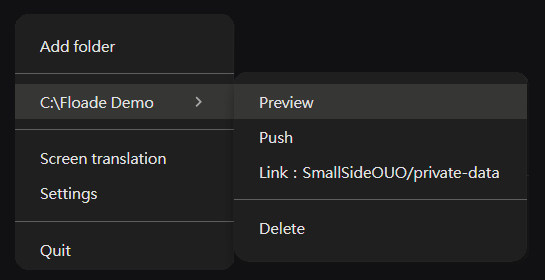
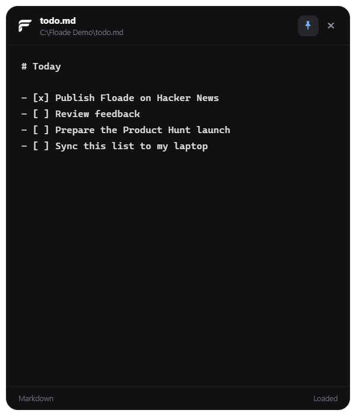
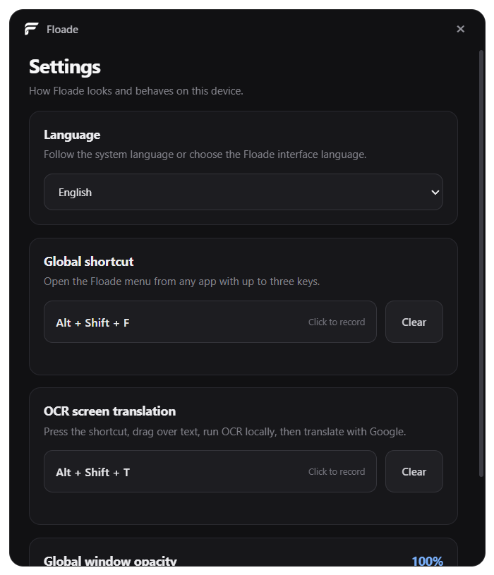
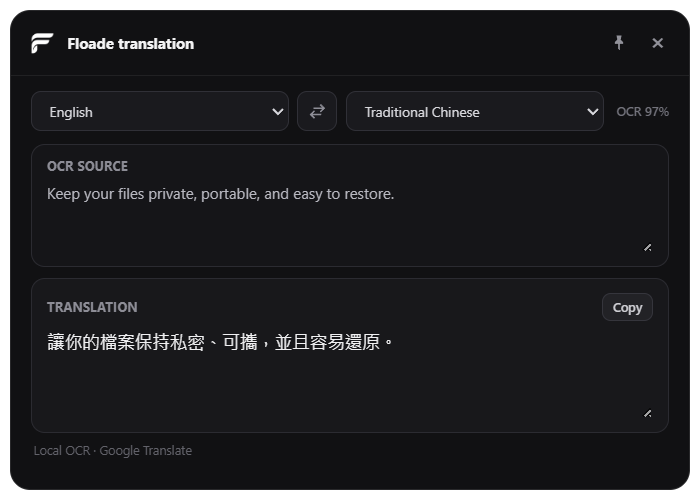

# Floade

[English](README.md) | [繁體中文](README.zh-TW.md)

Floade 是一個小型系統匣工具，可以把本機資料夾連結到 GitHub Private Repo，並用一次點擊 Push 所有本機變更。

從 Windows 開始選單啟動，或執行 `floade`，即可看到黑色小球與白色呼吸燈。滑鼠移到小球上會開啟 Floade 面板。右下角選單只有「設定」與「顯示／隱藏小球」。Repo 連結由 AI 透過本機 API 完成。

已開啟的 Markdown 視窗會自動載入外部檔案變更。若編輯器同時有尚未儲存的修改，Floade 會保留草稿並暫停儲存；請先複製你的編輯，再確認「從檔案重新載入」。

## 我為什麼做 Floade

我想快速把自己的資料存進自己控制的 GitHub Private Repo，而不是另外建立和維護一套雲端資料庫。資料仍然是本機資料夾中的普通檔案，GitHub 則提供我原本就在使用的遠端儲存層。

對我自己的使用情境來說，這可以得到：

- 快速把本機檔案保存到 Private Repo
- 使用 Git 歷史紀錄查看或復原以前的版本
- 透過一般的 Git clone、pull 與 push，在多部裝置存取及同步資料
- 不必自己維護一台 24/7 運作的伺服器，由 GitHub 保存遠端 Repo
- 所有內容仍是普通檔案，即使不用 Floade 也能直接開啟

另外，我自己也很需要更快的畫面翻譯方式。我不想為了翻譯而複製文字、覆蓋目前的剪貼簿內容，所以可以直接按快捷鍵框選螢幕上的文字，讓 Floade 在本機執行 OCR，再顯示翻譯結果。

Floade 沒有自己的雲端後端，也不會收到連結資料夾的副本；它只會執行本機 Git 與 GitHub CLI 操作。資料夾同步透過 Git 完成，每分鐘自動接收乾淨、閒置資料夾可快轉的 main 更新；分岔歷史需要自行處理合併。

## 功能

- [Android 手機文件](https://smallsideouo.github.io/Floade-need/mobile/)：可加入主畫面，瀏覽/編輯 Markdown、保留離線草稿與比較同步衝突，詳見[手機使用說明](docs/mobile-guide.md)
- 自動 Pull 每分鐘檢查一次；本機修改、文件開啟中或操作中時暫停。資料夾有「更新」按鈕，設定可關閉自動接收

- 黑色圓形與白色呼吸燈的透明浮動小球，可拖曳移動，位置與顯示狀態只儲存在本機
- Hover 小球開啟精簡面板，上方提供新增資料夾與翻譯，資料夾卡片保留預覽、Push、刪除；滑鼠移到面板時保持開啟，移開才收起
- 搜尋已加入資料夾中的 Markdown 文件，並記錄最近開啟的文件；全域快捷鍵可開啟面板並搜尋，Enter 開啟、Esc 收起
- 透過系統資料夾選擇視窗加入現有資料夾
- 將一個或多個本機 Markdown 檔案開成可編輯的桌面視窗
- Markdown 選擇視窗及文件視窗都支援置頂
- 可錄製最多三個按鍵組成的全域快捷鍵
- 用內建的本機 OCR 辨識框選畫面，再透過 Google 翻譯
- 可在翻譯視窗調整語言、交換上下文字與語言，並直接編輯任一文字框
- 55 種常見文字翻譯語言，選單分為「常用語言」與「其他語言」；依選用次數與最近使用時間自動排序，使用紀錄僅保存在本機
- 從小球面板開啟「文字翻譯」，在上方或下方輸入文字即可自動雙向翻譯，也能按「翻譯」或 `Ctrl+Enter` 立即翻譯，並可用圖釘將視窗置頂
- 翻譯視窗的上下文字框皆提供麥克風及朗讀按鈕；語音輸入後自動翻譯，再按一次即可停止
- 提供英文及繁體中文介面，可跟隨系統語言或手動切換
- 使用同一個透明度設定控制所有 Floade 視窗
- 提供本機 API，讓 AI 查詢資料夾、可寫入的 Private Repo 並完成連結；Windows 安裝版附帶呼叫工具，不需要 Node.js 或 API 金鑰
- 自動初始化 Git，以 `chore: sync data` 提交所有目前變更並 Push 至 `main`
- 連結資料夾若未設定 Git 提交者，會使用已登入 GitHub 帳號的名稱及隱私 Email 建立提交
- 每天本機時間 20:00 自動 Push 有變更的連結資料夾；若當天 20:00 後才啟動，會補做當日 Push
- 顯示處理中、成功及失敗通知
- 連結的資料夾路徑只儲存在本機；GitHub 憑證仍由 GitHub CLI 管理
- 支援 `floade`、`floade stop` 及 `floade restart`

## 介面截圖

| 系統匣操作 | 可編輯 Markdown |
| --- | --- |
|  |  |
| 設定 | OCR 翻譯 |
|  |  |

## 安全警告

Floade **不會加密你的檔案**。除了資料夾 `.gitignore` 已排除的內容之外，Floade 會 Stage 並 Commit 連結資料夾中的所有檔案。

畫面 OCR 會在本機執行；OCR 完成後，辨識出的文字會送到 Google 翻譯以取得結果。請勿框選你不希望傳送給 Google 的敏感文字。

語音辨識和朗讀使用本機 Windows 語音引擎，音訊不會上傳；辨識出的文字仍會送到 Google 翻譯。使用麥克風前請選好該文字框的語言，並允許 Windows 桌面應用程式存取麥克風。支援的語言依已安裝的 Windows 語音套件而定；缺少套件時會顯示提示。單次語音輸入最多五分鐘，關閉視窗會停止語音。

Push 敏感資料前請注意：

- 只連結由你控制的 Private Repo。
- 先檢查資料夾內容及其 `.gitignore`。
- 即使日後刪除敏感資料，內容仍可能保留在 Git 歷史中。

## 系統需求

- 使用安裝檔時需要 Windows 10 或更新版本
- Git
- [GitHub CLI](https://cli.github.com/)（可從 Floade 的 Link 視窗啟動瀏覽器登入）
- 只有透過指令安裝時才需要 Node.js 22 或更新版本

目前版本已在 Windows 測試。執行環境使用 Electron 的跨平台系統匣 API，但 macOS 與 Linux 的打包及 QA 尚未完成。

## 安裝

### Windows 安裝檔

從 [GitHub Releases](https://github.com/SmallSideOUO/Floade-need/releases/latest) 下載最新版 `Floade-Setup-*.exe` 並執行。目前安裝檔尚未進行程式碼簽章，因此 Windows SmartScreen 可能會顯示警告。

### 簡單的方法

直接跟 Codex 或 Claude Code 說：

> 幫我安裝 Floade：https://github.com/SmallSideOUO/Floade-need

### 指令安裝

```powershell
npm install --global github:SmallSideOUO/Floade-need
floade
```

如果其他套件已經提供全域 `floade` 指令，請先解除安裝或重新命名該套件。

## 使用方式

滑鼠移到小球上，或點擊小球開啟面板：

1. 選擇面板上方的「新增資料夾」，加入一個現有的本機資料夾。
2. 告訴本機 AI 助手要連結哪個 Private Repo，讓它透過 [Floade 本機 API](docs/local-api.md) 完成連結。原本的連結會保留；首次 GitHub 登入使用 `gh auth login --hostname github.com --web`。
3. 從資料夾卡片選擇 `Push`。

右下角圖示右鍵只提供「設定」與「顯示／隱藏小球」。拖曳小球可移動位置；在面板搜尋可直接開啟文件，下方可展開最近文件。退出可使用面板底部的「退出」或 `floade stop`。

從資料夾卡片選擇「預覽」，即可勾選一個或多個 `.md` 檔案。已連結且本機 Git 工作目錄沒有變更時，Floade 會先檢查 Repo 更新；如果資料夾是空的，則會自動 Clone。每個檔案會在各自的可編輯視窗中開啟，修改內容會自動儲存回原始本機檔案。使用圖釘按鈕可將選擇視窗或 Markdown 視窗保持置頂。

從系統匣主選單選擇「設定」，即可分別錄製「開啟小球面板」及「OCR 畫面翻譯」的全域快捷鍵，最多同時使用三個按鍵。畫面翻譯的預設快捷鍵是 `Alt+Shift+T`：按下後游標會變成十字，拖曳框選文字，Floade 就會在不讀取、不覆蓋剪貼簿的情況下顯示翻譯結果。偵測到中文時翻成英文，其他語言則翻成繁體中文。相同頁面也能切換介面語言，並將所有 Floade 視窗的透明度設為 40% 至 100%。Floade 預設跟隨作業系統語言，未支援的語言會使用英文。

`Push` 相當於執行：

```text
gh auth setup-git
git init
git remote add/set-url origin
git add -A
git commit -m "chore: sync data"
git branch -M main
git push -u origin main
```

Floade 不會執行 Force Push。如果遠端 Repo 存在衝突的 Git 歷史，Floade 會顯示失敗通知，而不是覆蓋遠端內容。

Windows 安裝版會在登入電腦時啟動，以便執行每日 Push。自動 Push 與手動 Push 使用相同的 Git 流程，僅處理有本機變更的資料夾。若 20:00 時程式未執行或電腦關機，當天稍後啟動時會補做一次；失敗時會顯示通知，也可手動重試。

## 指令

```powershell
floade          # 在背景啟動
floade stop     # 停止背景程序
floade restart  # 重新啟動背景程序
```

## 開發

```powershell
git clone https://github.com/SmallSideOUO/Floade-need.git
cd Floade-need
npm install
npm run check
npm start
```

## 社群

歡迎到 [Floade Discord](https://discord.gg/nKe2QAxF9) 提問、提供回饋或分享想法。

## 授權

[MIT](LICENSE)
